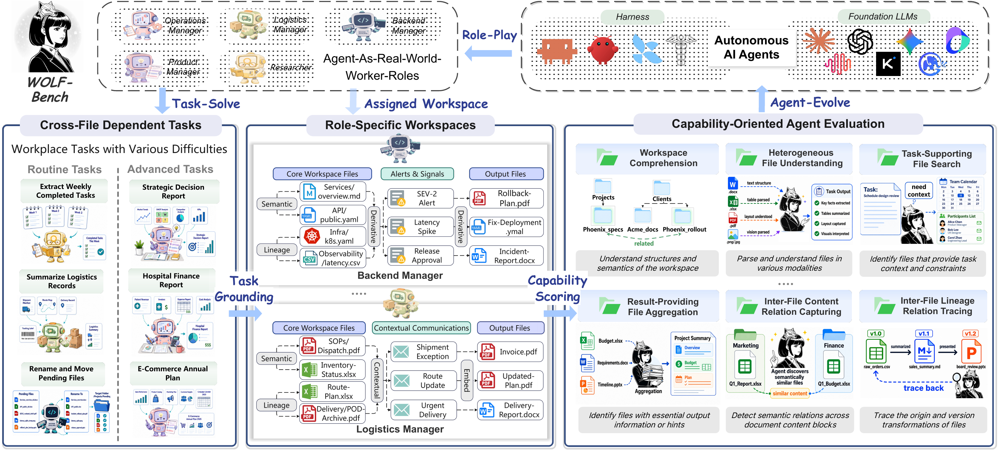
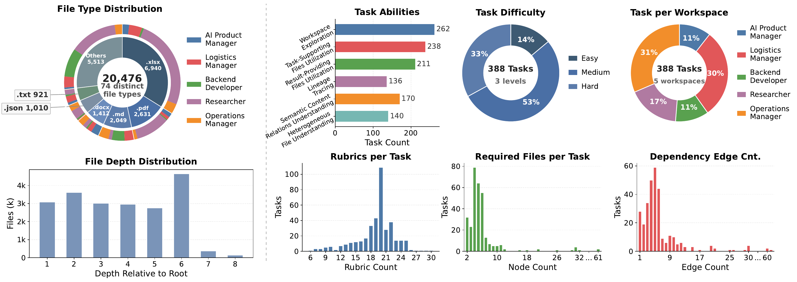

<div align="center">
  
</div>

<div align="center">
  <h1>Workspace-Bench</h1>
  <h3>Benchmarking AI Agents on Workspace Tasks with Large-Scale File Dependencies</h3>
</div>

<div align="center">
  <a href="#overview">Overview</a> •
  <a href="#leaderboard">LeaderBoard</a> •
  <a href="#dataset-introduction">Dataset Introduction</a> •
  <a href="#quick-start">Quick Start</a> •
  <a href="#arxiv-link">arXiv</a>
</div>

<br />

## Overview

Workspace-Bench 1.0 is a benchmark for evaluating AI agents on **workspace tasks with large-scale file dependencies**. It is built to study a capability we call **Workspace Learning**: whether an agent can identify, reason over, exploit, and update explicit and implicit dependencies among heterogeneous files in a real worker's workspace.

Unlike benchmarks that either place all information directly in the prompt or provide a small bundle of task-specific files, Workspace-Bench evaluates agents in realistic workspaces where they must independently explore directories, locate relevant evidence, understand cross-file relations, and produce correct deliverables. The benchmark is centered on real-world workplace behavior rather than isolated tool-use or single-file question answering.

Workspace-Bench contains:

- **5** realistic worker profiles: Operations Manager, Logistics Manager, AI Product Manager, Researcher, and Backend Developer
- **74** file types across heterogeneous workspace environments
- **20,476** files, with workspaces scaling up to **20GB**
- **388** tasks, each paired with an explicit file dependency graph
- **7,399** fine-grained rubrics for evaluation
- **Workspace-Bench-Lite**, a 100-task subset that preserves the benchmark distribution while reducing evaluation cost by about **70%**

<div align="center">
  
</div>

The figure above illustrates the overall design of Workspace-Bench. Agents are placed into role-specific workspaces with realistic cross-file dependent tasks, and are evaluated with capability-oriented rubrics that measure not only final correctness but also the ability to navigate complex workspace structure and file relations.

## LeaderBoard

<div align="center">
  
</div>

The figure above shows rubric pass rates on Workspace-Bench-Lite across multiple combinations of agent harnesses and backbone LLMs.
It highlights that strong foundation models matter, but harness design still plays a major role in efficiency, cost, and final performance.
Detailed leaderboard tables, per-model breakdowns, and additional analyses will be released together with the public benchmark release.

## Dataset Introduction

The full dataset is **coming soon**.
We plan to release task specifications, input files, standardized output formats, and evaluation scripts where applicable.

<div align="center">
  
</div>

The distribution figure summarizes the current benchmark composition from several perspectives: file types, task abilities, task difficulty, workspace allocation, rubric counts, required files per task, and dependency edge counts.
These statistics reflect the diversity and complexity of Workspace-Bench and show that the benchmark is not limited to a single file format, workspace style, or task pattern.
In particular, Workspace-Bench covers multiple professional roles and difficulty levels, while preserving rich inter-file dependency structures that are essential for realistic workspace evaluation.

## Quick Start

**Coming soon.**

We will release the dataset, evaluation pipeline, and example usage instructions for running agents on Workspace-Bench and Workspace-Bench-Lite.
The public release will include the necessary task assets, output specifications, and benchmarking scripts.

## arXiv Link

Paper link: **coming soon**

If you use Workspace-Bench in your research, please cite our paper once the arXiv version is available.

```bibtex
@misc{Workspacebench2026,
  title        = {Workspace-Bench: A Benchmark for Real-World Agentic Workflows},
  author       = {TODO: Authors},
  year         = {2026},
  eprint       = {TODO: arXiv-ID},
  archivePrefix= {arXiv},
  primaryClass = {cs.CL},
  url          = {https://arxiv.org/abs/2605.03596}
}
```